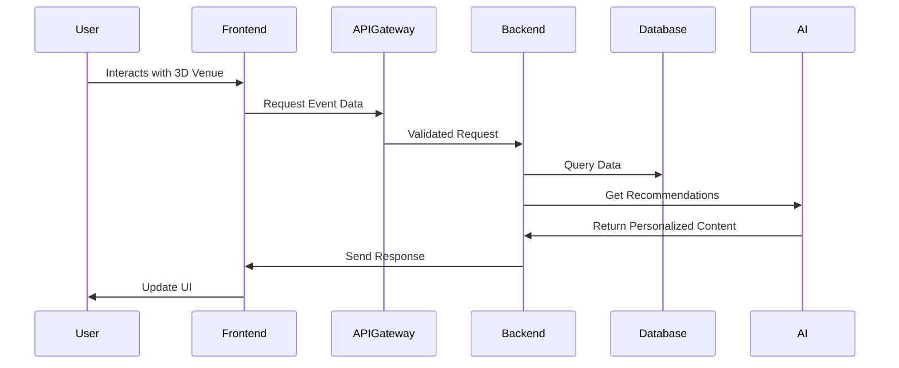
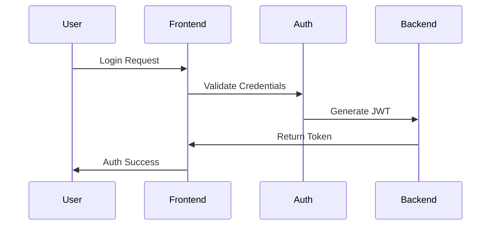
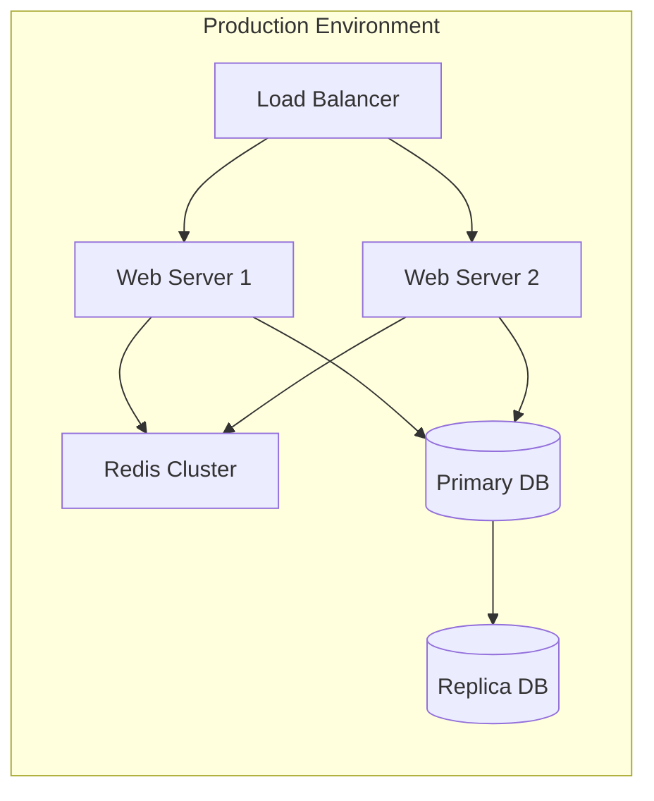

# HOY Platform Architecture

## System Architecture Overview
```mermaid
graph TB
    subgraph "Client Layer"
        Web["Web Application (Next.js)"]
        Mobile["Mobile Web (PWA)"]
    end

    subgraph "Frontend Services"
        UI["UI Components"]
        State["State Management"]
        3D["3D Engine (Three.js)"]
        Analytics["Analytics Engine"]
    end

    subgraph "API Gateway Layer"
        API["API Gateway"]
        Cache["Redis Cache"]
        Auth["JWT Auth"]
    end

    subgraph "Backend Services"
        Events["Event Service"]
        Users["User Service"]
        Media["Media Service"]
        AI["AI Service"]
        Search["Search Service"]
    end

    subgraph "Data Layer"
        DB[(PostgreSQL)]
        ES[(Elasticsearch)]
        S3[(AWS S3)]
    end

    Web --> Frontend Services
    Mobile --> Frontend Services
    Frontend Services --> API
    API --> Backend Services
    Backend Services --> Data Layer
```

## Component Architecture

### Frontend Components
```
frontend/
├── components/
│   ├── layout/
│   │   ├── Navigation.tsx
│   │   ├── Footer.tsx
│   │   └── Layout.tsx
│   │
│   ├── 3d/
│   │   ├── VenueExplorer/
│   │   │   ├── Scene.tsx
│   │   │   ├── Controls.tsx
│   │   │   └── Models/
│   │   ├── EventPreview/
│   │   └── Animations/
│   │
│   ├── events/
│   │   ├── BentoGrid/
│   │   │   ├── EventCard.tsx
│   │   │   ├── FeaturedEvent.tsx
│   │   │   └── EventGrid.tsx
│   │   ├── EventDetails/
│   │   └── EventFilters/
│   │
│   ├── user/
│   │   ├── Profile/
│   │   ├── Authentication/
│   │   └── Dashboard/
│   │
│   └── shared/
│       ├── Buttons/
│       ├── Forms/
│       └── Modals/
│
├── hooks/
│   ├── use3D.ts
│   ├── useAuth.ts
│   └── useEvents.ts
│
└── services/
    ├── api/
    ├── three/
    └── analytics/
```

### Backend Services Architecture
```
backend/
├── apps/
│   ├── events/
│   │   ├── models.py
│   │   ├── services.py
│   │   ├── serializers.py
│   │   └── views.py
│   │
│   ├── users/
│   │   ├── models.py
│   │   ├── auth.py
│   │   └── profiles.py
│   │
│   ├── media/
│   │   ├── services.py
│   │   └── processors.py
│   │
│   └── ai/
│       ├── chatbot/
│       ├── recommendations/
│       └── image_processing/
│
└── core/
    ├── settings/
    ├── middleware/
    └── utils/
```

## Key Features Implementation

### 3D Venue Explorer
```typescript:frontend/components/3d/VenueExplorer/Scene.tsx
import { Canvas } from '@react-three/fiber'
import { Suspense } from 'react'

export const VenueExplorer = () => {
  return (
    <Canvas>
      <Suspense fallback={<LoadingScreen />}>
        <VenueModel />
        <Lighting />
        <InteractiveElements />
        <Effects />
      </Suspense>
    </Canvas>
  )
}
```

### Event Bento Grid
```typescript:frontend/components/events/BentoGrid/EventGrid.tsx
const EventGrid = () => {
  return (
    <motion.div className="grid-container">
      <FeaturedEvent />
      <RegularEvents />
      <UpcomingEvents />
      <TrendingSection />
      <ParallaxImages />
    </motion.div>
  )
}
```

### AI Integration
```python:backend/apps/ai/services.py
class AIService:
    def __init__(self):
        self.openai = OpenAI()
        self.recommendation_engine = RecommendationEngine()
    
    async def generate_event_recommendations(self, user_profile):
        # AI recommendation logic
        pass

    async def process_chat_query(self, query):
        # ChatGPT integration
        pass
```

## Data Flow Architecture


## Performance Optimizations

### Image Loading Strategy
```typescript:frontend/services/media/imageLoader.ts
const imageLoader = {
  progressive: true,
  placeholder: 'blur',
  priority: true,
  sizes: '(max-width: 768px) 100vw, (max-width: 1200px) 50vw, 33vw'
}
```

### Caching Strategy
```typescript:frontend/services/cache/strategy.ts
const cacheStrategy = {
  staleWhileRevalidate: 60,
  maxAge: 3600,
  revalidate: true
}
```

## Security Implementation

### Authentication Flow


## Deployment Architecture
